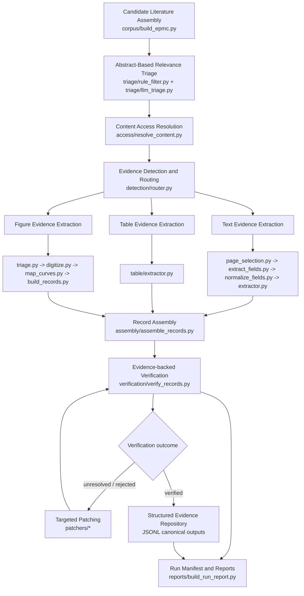

# SkinMiner

LLM-powered multimodal scientific literature mining framework for dermal formulation science.

[中文 README](./README.md)

This repository is being refactored from a collection of step-based research scripts into a clearer, package-based framework. The goal is not to rewrite all scientific logic at once, but to preserve working extraction logic while making the system more modular, reproducible, and ready for later benchmarking.

## 1. What Changed in the Refactor

### 1.1 From step scripts to a package-based architecture

The original codebase was organized mostly as sequential `scripts/step*.py` files. Input and output paths, scope rules, verification logic, and modality-specific extraction behavior were often embedded inside individual scripts.

The refactored framework now uses explicit modules:

- `corpus/`
- `triage/`
- `access/`
- `detection/`
- `extractors/`
- `assembly/`
- `verification/`
- `patchers/`
- `policies/`
- `schemas/`
- `reports/`
- `utils/`

This makes the codebase easier to test, replace in parts, and compare across models or configurations.

### 1.2 Unified structured schemas

The framework no longer treats the final output as only CSV rows. It now uses shared structured objects:

- `Record`
- `EvidenceItem`
- `ContentAccess`
- `RouteDecision`
- `ExtractorRunContext`
- `PatchMetadata`
- `RecordProvenance`

Defined in:

- `schemas/models.py`

This enables:

- JSONL as the canonical record format
- evidence-backed records with provenance and patch metadata
- easier downstream evaluation and reporting

### 1.3 Centralized policy layer

Strict scope rules such as:

- ibuprofen only
- 5% w/w required
- Franz diffusion cell required
- IVPT / IVRT only
- amount endpoint only
- endpoint time required

are now centralized in:

- `policies/v1_strict_ibuprofen_5pct.py`
- `policies/v2_accept_wv.py`
- `policies/v3_any_ibuprofen_concentration.py`
- `policies/v4_accept_flux.py`

This prevents scope logic from being scattered across extraction and verification modules.
`run_pipeline.py --policy` currently supports `v1 / v1_strict_ibuprofen_5pct / v2 / v2_accept_wv / v3 / v3_any_ibuprofen_concentration / v4 / v4_accept_flux`.

### 1.4 Standardized extractor interfaces

Across text, table, and figure branches, extractors are being standardized around:

```python
extract(content_handle, route_decision, policy, run_context) -> list[Record]
```

Each extractor is expected to:

- emit candidate `Record` objects
- attach `EvidenceItem` objects
- record route and provenance metadata
- avoid treating ad hoc CSV files as the primary output
- the table extractor now normalizes recovered endpoint fields directly before record-level assembly

### 1.5 Clean split between assembly and verification

The refactor separates consolidation from final acceptance decisions:

- `assembly/assemble_records.py`
  handles cross-modality consolidation, normalization, and schema alignment
- `verification/verify_records.py`
  handles evidence sufficiency, policy checks, failure taxonomy, and final statuses

Current verification also performs controlled source-backed normalization and support-evidence strengthening before final policy evaluation, for example:

- strengthening `device` evidence from route notes, source notes, evidence snippets, and source-document fragments
- strengthening `device` normalization with donor/receptor, vertical-diffusion, diffusion-area, and sampling-port signals instead of only explicit `Franz` keywords
- using more conservative generic `diffusion cell` inference so generic mentions without permeation or barrier context are less likely to be treated as target-device evidence
- excluding obvious non-target assay contexts such as `PAMPA / skin PAMPA` from being normalized into `Franz diffusion cell`
- adding support evidence for `diffusion_area_cm2`, API concentration, and endpoint time when the evidence is explicit enough
- aggregating paper-level `device` hints, paper-level unique diffusion-area hints, and label-level or paper-level API-concentration hints before record-by-record policy evaluation
- refining `study_type` only when the record is still uncertain, instead of aggressively downgrading already plausible IVPT/IVRT assignments
- applying stricter hard gates for strict-scope acceptance so `flux / Jss / percent-only / non-5%-w/w concentration` records are less likely to slip into `verified`
- using route-aware acceptance, so `table` remains the most permissive branch while `text / mixed / figure` require stronger evidence corroboration before becoming `verified`
- assigning a `scope_bucket` per record, including `strict_in_scope`, `recoverable_unresolved`, and `useful_but_out_of_scope`
- assigning finer recoverable `scope_tags`, such as `recoverable_api_basis`, `recoverable_area`, `recoverable_endpoint`, `recoverable_endpoint_time`, and `recoverable_support_gap`
- keeping that strengthening inside structured schema fields and `EvidenceItem`s rather than mixing acceptance logic back into assembly
- the current verifier is also intentionally `precision-first`: it is allowed to push borderline records into `recoverable_unresolved` rather than letting high-risk records pass into `verified`
- accordingly, `verified` currently means “strict automatic pass” rather than “the final truth a human reviewer would necessarily confirm”

This makes the architecture cleaner and easier to evaluate methodologically.

### 1.6 Targeted patching as a first-class subsystem

Targeted patching is now treated as evidence recovery, not generic cleanup:

- `patchers/patch_api_concentration.py`
- `patchers/patch_endpoint.py`
- `patchers/patch_endpoint_time.py`
- `patchers/patch_area.py`

Patchers are intended to:

- operate only on unresolved or failed candidate records
- add new `EvidenceItem` objects when they recover missing evidence
- record patch metadata for traceability and re-verification
- the current patchers have been strengthened for area, endpoint, endpoint time, and API-concentration recovery, and may now look back into source-document fragments
- API-concentration recovery now reuses shared context rules across table extraction, verification, and patching so excipient percentages are less likely to be mistaken for ibuprofen loading
- area and API-concentration patchers can now also reuse shared paper-level or formulation-label-level hints when a single record does not carry enough local evidence by itself
- endpoint and API-concentration patchers may now also revise populated but suspicious values when strict verification marks them as ambiguous or likely out-of-scope
- API concentration fields are now normalized more consistently across assembly and verification, so `% w/w`, `% w/v`, `mg/g`, `mg/ml`, and `mM` are less likely to carry unstable basis strings
- assembly now also performs proactive table-support promotion, so stronger table-side formulation, API, area, and support evidence can be merged into related `text / mixed / figure` records before final verification
- ablation runs can pass `--no-patching` to skip every targeted patcher; this switch is stored in the run manifest and resume signature

### 1.7 Stronger figure traceability

The figure branch is now structured more explicitly:

- `extractors/figure/triage.py`
- `extractors/figure/digitize.py`
- `extractors/figure/map_curves.py`
- `extractors/figure/build_records.py`
- `extractors/figure/models.py`

The current design improves:

- typed intermediate artifacts
- trace ids linking triage, digitization, mapping, and record assembly
- replay outputs for digitization, including crops, masks, overlays, and mapping zooms
- mapping traceability
- mapping confidence and provenance

### 1.8 Better reproducibility outputs

Runs now capture more structured metadata:

- run manifest
- model names
- policy name
- prompt / config paths
- input sources
- failure taxonomy counts
- patch success counts

Implemented mainly through:

- `utils/manifest.py`
- `reports/build_run_report.py`
- `utils/long_run.py`
- `utils/resume.py`

The framework now also includes a more practical engineering feature:

- `--resume`
  for stage-level resume
- completed stages can be skipped via stage markers
- long iterative stages such as `LLM triage / content access / routing / text / table / figure` try to continue from existing JSONL checkpoints
- stage markers now also store a run-signature digest, input counts, output counts, and expected output paths
- `--resume` now refuses to reuse incompatible stage markers from a different configuration in the same `output-dir`
- when old `.resume` marker digests change because of small code fixes, but the existing `run_manifest.jsonl` still proves the same high-level run configuration, the current version will automatically use a soft-compatibility resume path and reuse the existing markers
- this goes beyond monitoring-only long-run mode and is intended for real overnight or full-scale runs
- the latest recovery-promotion round also adds `receptor_volume_ml`, two-pass endpoint shared-hint replay, a more conservative API-concentration patch quality check, and stricter separation between formulation concentration context and receiver / endpoint assay concentration context

### 1.8.1 LLM provider abstraction

The LLM call layer is now routed through a thin provider abstraction in `utils/llm_client.py`.

- `run_pipeline.py --llm-provider` supports `openai` and `anthropic`
- the default remains `openai`, preserving existing behavior unless explicitly changed
- `--llm-provider anthropic` defaults the stage model family to `claude-sonnet-4-6`, while stage-level model overrides still work
- run manifests now record `llm_provider` alongside model names and stage model overrides
- Anthropic is imported lazily, so OpenAI-only runs do not require the Anthropic SDK to be loaded

### 1.9 Optional LLM triage and the current content strategy

Two pipeline behaviors are now shown explicitly in the live terminal panel:

- `LLM Triage` is an optional stage
- `Content Access + Routing` follow `structured-first routing + structured-first text/table extraction + auto PDF for figure and fallbacks`

Relevant modules:

- `run_pipeline.py`
- `triage/llm_triage.py`
- `access/content_strategy.py`
- `access/resolve_content.py`

In practice this means:

- if `--with-llm-triage` is not provided, the terminal panel will show `LLM Triage` as `SKIPPED / disabled`
- that is intentional, not an error; the run is using only rule-based abstract triage
- optional LLM triage is valuable when the corpus is broad, noisy, or weakly filtered by rules
- for small debug runs, hand-curated inputs, or low-cost iteration, it is reasonable to leave it off

The current content strategy is:

- OA `PMC XML / HTML` are treated as the preferred textual representations
- the router now prefers local or remote `PMC XML / HTML`, and only falls back to local PDF when structured content is unavailable
- when the LLM still returns `unresolved`, the router now also applies a conservative heuristic fallback to improve text/table/figure/mixed recall
- the text extractor now also prefers structured `PMC XML / HTML` evidence windows and falls back to PDF pages only when structured content is unavailable
- the table extractor now also prefers structured `PMC XML / HTML` tables and falls back to PDF pages only when structured content is unavailable
- the figure extractor still retains the strongest legacy PDF dependency
- therefore the pipeline still auto-materializes local PDFs when needed, even if `--download-content` is not explicitly provided
- pass `--no-auto-pdf-download` only if you intentionally want to disable this bridge behavior

### 1.10 Figure preprocessing, bbox replay, and blockage summaries

This round also added a set of more engineering-focused stability improvements:

- `extractors/figure/digitize.py` no longer depends only on the triage-provided `plot_bbox`
- when the triage bbox is missing, the digitizer now attempts automatic plot-region detection
- when the bbox is coarse, the digitizer now refines it using foreground signals
- figure digitization now emits additional artifacts:
  - `bbox overlay`
  - `preprocessed image`
  - richer bbox / edge diagnostics

This makes figure failures easier to interpret: the failure is less likely to look like a single opaque count and more likely to expose whether the issue came from missing plot context, weak bbox localization, or insufficient extracted edges.

At the reporting layer, `reports/build_run_report.py` now also emits a clearer blockage summary for:

- access unresolved / error reasons
- unresolved routing reasons
- text / table extractor source errors
- patcher skipped / failed reasons

Figure failure propagation is also more disciplined now:

- paper-level figure failure notes are attached only to `figure` or `mixed` records during assembly
- record-level verification no longer marks a successful figure-backed endpoint as a figure-digitization failure just because some other curve from the same paper failed

In addition to `run_report.json` / `run_report.md`, the pipeline now also writes:

- `report/blockage_summary.csv`

### 1.11 Optional LLM adjudication prototype

To preserve room for a later second-opinion layer, the repository now also includes an **optional** prototype:

- `verification/llm_adjudicate.py`

Its role is not to replace the main verifier. Instead, it is now intended mainly for:

- high-value `recoverable_unresolved` records
- especially `ambiguous_api_concentration / missing_area / missing_endpoint / unit_normalization_failed`
- rescue-oriented ranking of which unresolved records are most worth revisiting

The current design principles are:

- `rule-based verification` remains the production verifier
- `LLM adjudication` is only a selective second-opinion layer
- it is now optionally wired into `run_pipeline.py` as an **audit-only** stage via `--with-llm-adjudication`
- in practice it now behaves more like an audit-only ranking aid for recoverable unresolved records than like a broad second verifier
- in audit-only mode it writes second-opinion outputs and report summaries, but does **not** override `verified_records`
- the live pipeline now also shows an `LLM Adjudicate` stage and writes `report/llm_adjudication_summary.csv`
- it is still better treated as diagnosis, error analysis, or a later benchmark module than as the primary verifier

This is intentional because:

- the strict scope needs stable, auditable hard boundaries
- if extraction and final acceptance are both fully LLM-driven, correlated error and self-confirmation become more likely
- manual review is currently an offline calibration resource, not a required production step

Recent recovery promotion updates also tightened formulation recovery:

- `% (w/w)` and `% (w/v)` forms are now parsed explicitly instead of falling back to a plain `%`
- explicit molar concentration parsing no longer confuses physical dimensions such as `4.6 mm` with `4.6 mM`
- verification and patching now compare concentration-hint quality, so stronger `5% w/w` paper-level hints can override weaker `mM / mg/mL` candidates when the strict-scope evidence is better

### 1.11 Query / prompt versioning and evaluation scaffolding

To make later experiments genuinely comparable, the framework now treats queries and prompts as versioned assets:

- `corpus/query_profiles.py`
  - provides named query profiles
  - currently includes a baseline OA query and a narrower Franz-focused query
- `run_pipeline.py`
  - adds `--query-profile`
  - adds `--list-query-profiles`
  - still allows `--query` as an explicit override when needed
- the run manifest and report now record:
  - `query_profile`
  - `query_profile_version`
  - `query_source`
  - `prompt_assets`

Evaluation preparation has also been promoted from a TODO into a formal scaffold:

- `evaluation/README.md`
- `evaluation/fixtures/README.md`
- `evaluation/gold_labels.schema.json`
- `evaluation/templates/fixture_manifest_template.json`
- `evaluation/templates/gold_labels_template.jsonl`

This is not yet a full evaluation suite, but it is enough to start building:

- text-only fixtures
- table-only fixtures
- figure-only fixtures
- mixed-route fixtures
- record-level gold labels

### 1.12 Further enhancements in this round: device/API recovery, figure failure feedback, run profiles, remote cache, and evaluation CLI

This round also added six more practical improvements aimed at large-run usability:

- stronger `device normalization`
  - `extractors/common.py`
  - `verification/verify_records.py`
  - the framework is now better at distinguishing explicit `Franz diffusion cell` evidence from generic diffusion-cell mentions, and it now selects stronger support fragments
- stronger `API concentration recovery`
  - `utils/units.py`
  - `patchers/patch_api_concentration.py`
  - `verification/verify_records.py`
  - component-level clues are reused more aggressively, and more `% w/w` / `mg/g` / `mg per g` / `drug loading` patterns are normalized
- figure failures now feed beyond reporting
  - `extractors/figure/build_records.py`
  - `assembly/assemble_records.py`
  - `verification/failure_taxonomy.py`
  - `verification/verify_records.py`
  - digitization failures, missing plot context, and unresolved figure mappings now enter assembly/verification as paper-level source notes and taxonomy signals
- named `run profiles`
  - `configs/run_profiles.py`
  - `run_pipeline.py`
  - you can now fix common operating modes with `--run-profile`, including:
    - `balanced_full`
    - `text_table_baseline`
    - `budget_lean`
    - `figure_deep`
  - `run_pipeline.py` now also supports stage-level model overrides such as `--routing-model`, `--table-model`, `--figure-triage-model`, `--figure-map-model`, and `--llm-adjudication-model`
- remote structured-source caching
  - `utils/source_cache.py`
  - `detection/router.py`
  - `extractors/text/page_selection.py`
  - `extractors/table/extractor.py`
  - `patchers/common.py`
  - remote HTML/XML reads are now cached locally to reduce repeated requests and source-site instability
- evaluation is no longer only directory scaffolding
  - `evaluation/models.py`
  - `evaluation/validate_gold_labels.py`
  - `evaluation/score_run.py`
  - the repository now includes lightweight gold-label validation and basic run-vs-gold scoring utilities

Useful commands now include:

- `python run_pipeline.py --list-run-profiles`
- `python -m evaluation.validate_gold_labels --gold-jsonl evaluation/templates/gold_labels_template.jsonl`
- `python -m evaluation.score_run --gold-jsonl <gold.jsonl> --predicted-jsonl <records.jsonl> --output-json <summary.json>`
- `python -m evaluation.validate_gold_labels --gold-csv outputs/gold_audit_set/gold_set_seed_round1.csv`
- `python -m evaluation.score_run --gold-csv outputs/gold_audit_set/gold_set_seed_round1.csv --output-json outputs/gold_audit_set/score_round1.json --output-md outputs/gold_audit_set/score_round1_summary.md`
- This path now also supports separate scope-precision vs end-to-end precision reporting via derived `gold_scope_correct / gold_value_correct` columns.

## 2. Architecture Overview



At a higher level, the framework corresponds to seven major stages:

1. Candidate Literature Assembly
2. Abstract-Based Relevance Triage
3. Content Access Resolution
4. Evidence Detection and Routing
5. Modality-Specific Extraction
6. Record Assembly and Evidence-Backed Verification
7. Structured Evidence Repository / Dataset View

## 3. Module Responsibilities

### 3.1 `corpus/`

Main file:

- `corpus/build_epmc.py`

Responsibilities:

- Europe PMC retrieval
- configurable query / max results / output path
- deduplication and candidate corpus generation

### 3.2 `triage/`

Main files:

- `triage/rule_filter.py`
- `triage/llm_triage.py`
- `triage/prompts.py`

Responsibilities:

- rule-based abstract screening
- LLM-based abstract triage
- output relevance labels, confidence, and hints
- `LLM triage` is optional in the main pipeline, so the terminal panel may show `SKIPPED / disabled`

### 3.3 `access/`

Main file:

- `access/resolve_content.py`

Responsibilities:

- OA-only content resolution
- prefer PMC XML
- use HTML next
- fall back to PDF only when necessary
- current default content strategy is `structured-first routing + structured-first text/table extraction + auto PDF for figure and fallbacks`
- the terminal status panel now shows the active `routing / text / table / figure` backends directly in `Content Strategy`
- `--download-content` means eager primary-content download
- even without `--download-content`, local PDFs may still be auto-materialized when the figure branch or PDF fallbacks require them
- emit normalized `ContentAccess`

### 3.4 `detection/`

Main file:

- `detection/router.py`

Responsibilities:

- detect route candidates from full-text evidence anchors
- the router now prefers `PMC XML / HTML` before falling back to local PDF
- support `text`, `table`, `figure`, `mixed`, and `unresolved`
- emit `RouteDecision` with anchor evidence and rationale

### 3.5 `extractors/text/`

Main files:

- `extractors/text/page_selection.py`
- `extractors/text/extract_fields.py`
- `extractors/text/normalize_fields.py`
- `extractors/text/extractor.py`

Responsibilities:

- select structured evidence blocks or PDF page windows
- extract structured fields
- normalize fields and units
- support endpoint, endpoint time, device, barrier, and conditions
- emit evidence-backed `Record` objects

### 3.6 `extractors/table/`

Main file:

- `extractors/table/extractor.py`

Responsibilities:

- treat tables as an independent modality
- prefer `PMC XML / HTML` tables before falling back to PDF pages
- extract formulation composition
- extract ingredient concentration
- extract endpoint summary values
- preserve units and basis when available
- emit standardized `Record` objects

### 3.7 `extractors/figure/`

Main files:

- `extractors/figure/models.py`
- `extractors/figure/triage.py`
- `extractors/figure/digitize.py`
- `extractors/figure/map_curves.py`
- `extractors/figure/build_records.py`

Responsibilities:

- figure triage
- CV-based digitization
- curve-to-formulation mapping
- replay artifact generation, including triage page images, digitization crops, masks, overlays, and mapping zooms
- figure-backed record construction
- traceable mapping confidence, typed endpoint artifacts, and provenance chains back to the figure assets

### 3.8 `assembly/`

Main file:

- `assembly/assemble_records.py`

Responsibilities:

- consolidate candidate records across modalities
- normalize fields and units
- align the final schema shape
- avoid making final acceptance decisions

### 3.9 `verification/`

Main files:

- `verification/verify_records.py`
- `verification/failure_taxonomy.py`

Responsibilities:

- evaluate evidence sufficiency
- apply policy checks
- assign:
  - `verified`
  - `unresolved`
  - `rejected`
- assign structured failure reasons

### 3.10 `patchers/`

Main files:

- `patchers/patch_api_concentration.py`
- `patchers/patch_endpoint.py`
- `patchers/patch_endpoint_time.py`
- `patchers/patch_area.py`
- `patchers/common.py`

Responsibilities:

- targeted evidence recovery on unresolved or failed records
- recover API concentration, endpoint time, or area evidence
- attach new `EvidenceItem` objects on success
- preserve patch metadata for re-verification and reporting

### 3.11 `reports/`

Main files:

- `reports/build_run_report.py`
- `reports/migration_notes_round1.md`
- `reports/evaluation_round_todos.md`
- `reports/next_step_optimization_tasks.md`

Responsibilities:

- run-level reporting
- route distribution
- extractor output counts
- verification outcome counts
- scope-bucket counts, including `useful_but_out_of_scope`
- failure taxonomy counts
- failure taxonomy counts by route
- figure-specific failure summaries across triage, digitization, and mapping
- LLM reliability summaries, including retry and malformed-output buckets when long-run mode is enabled
- patch success counts
- CSV export views
- TODO hooks for future evaluation

### 3.12 `schemas/`, `utils/`, and shared helpers

Main files:

- `schemas/models.py`
- `utils/io.py`
- `utils/manifest.py`
- `utils/units.py`
- `extractors/common.py`

Responsibilities:

- shared schema definitions
- JSONL / CSV export helpers
- run manifest capture
- unit normalization
- shared API-concentration parsing and context rules
- stronger device-label normalization helpers
- common provenance and artifact helpers

## 4. Current Directory Layout

```text
project_root/
  corpus/
  triage/
  access/
  detection/
  extractors/
    text/
    table/
    figure/
  assembly/
  verification/
  patchers/
  policies/
  schemas/
  reports/
  utils/
  scripts/           # retained legacy step scripts for reference
  run_pipeline.py
```

## 5. Legacy-to-New Mapping

| Legacy script | New module |
| --- | --- |
| `step1_build_corpus_epmc.py` | `corpus/build_epmc.py` |
| `step2_rule_screen.py` | `triage/rule_filter.py` |
| `step3_stage2_openai.py` | `triage/llm_triage.py` |
| `step4_2_make_fulltext_inventory.py` + `step4_3_download_fulltext_oa.py` | `access/resolve_content.py` |
| `step5_evidence_index_openai_v1_3.py` | `detection/router.py` |
| `step6_extract_records_openai_v1_2.py` | `extractors/text/*` |
| `step7_formulation_table_extract_openai.py` | `extractors/table/extractor.py` |
| `step7_figure_triage_openai.py` | `extractors/figure/triage.py` |
| `step7_figure_digitize_cv.py` | `extractors/figure/digitize.py` |
| `step7_map_curves_to_formulations_openai_vision.py` | `extractors/figure/map_curves.py` |
| `step7_build_figure_records.py` | `extractors/figure/build_records.py` |
| `step7_merge_text_figure_v1.py` | `assembly/assemble_records.py` |
| `step6_5_verify_openai.py` + embedded scope logic | `verification/*` + `policies/*` |

## 6. Pipeline Entry Point

Main entry:

- `run_pipeline.py`

The current minimal flow is:

1. build or load corpus
2. rule triage
3. optional LLM triage
4. OA access resolution
5. structured-first routing context preparation plus automatic PDF materialization when required by the figure branch or PDF fallbacks
6. routing
7. table extraction
8. structured-first text extraction with PDF fallback
9. optional figure extraction
10. assembly
11. initial verification
12. targeted patching
13. re-verification
14. report / manifest / export

Example:

```bash
python run_pipeline.py --input-csv data/corpus_ibuprofen.csv --with-llm-triage --enable-figure --export-csv
```

Lightweight example:

```bash
python run_pipeline.py --input-csv data/corpus_ibuprofen.csv
```

If you want to disable the default automatic PDF backfill:

```bash
python run_pipeline.py --input-csv data/corpus_ibuprofen.csv --no-auto-pdf-download
```

Long-run mode:

```bash
python run_pipeline.py --build-corpus --max-results 50000 --with-llm-triage --enable-figure --export-csv --long-run-mode --progress-every 10 --access-checkpoint-every 10 --long-run-log-every 10 --output-dir outputs/full_run_01
```

This mode additionally writes:

- `long_run/events.jsonl`
  stage start / progress / finish / failure events plus per-module LLM usage events
- `long_run/state.json`
  the latest machine-readable snapshot of the running pipeline
- `long_run/summary.json`
  an end-of-run summary including the last error location, cumulative LLM usage by module, and per-module retry / malformed-output statistics

It is intended for overnight or full-scale runs. It complements `run_manifest.jsonl` and `report/run_report.*` rather than replacing them.
The current text/table batch extractors also record single-paper source failures in raw JSONL and skip those papers instead of aborting the whole run.

Resume mode:

```bash
python run_pipeline.py --build-corpus --max-results 50000 --with-llm-triage --enable-figure --export-csv --long-run-mode --resume --progress-every 10 --access-checkpoint-every 10 --long-run-log-every 10 --output-dir outputs/full_run_03
```

Notes:

- `--resume` should be used with the same `--output-dir`
- completed stages write `.resume/<stage>.done.json`
- completed stage markers now include a run-signature digest plus basic input/output consistency metadata
- if a previous run was interrupted, the next run will prefer skipping already-finished stages
- for `LLM triage / content access / routing / text / table / figure`, partially written JSONL checkpoints are also used to continue work when possible
- if the current configuration does not match the stored run signature, `--resume` will fail loudly instead of silently reusing incompatible outputs
- if only the digest changed after a code fix, but the manifest still matches `model / policy / run profile / query profile / adjudication` and the same corpus query, `--resume` will now continue the same run instead of forcing a fresh output directory
- `long_run/*` still handles monitoring and audit trails; `--resume` handles execution recovery

## 7. Output Discipline

### 7.1 Canonical outputs

- JSONL is the canonical source of truth for record-level outputs
- CSV is only an export or view
- no module should depend on CSV as the only source of truth

### 7.2 Common outputs

- `corpus.jsonl`
- `rule_pass.jsonl`
- `llm_triage.jsonl`
- `content_access.jsonl`
- `route_decisions.jsonl`
- `table_records.jsonl`
- `text_records.jsonl`
- `figure_records.jsonl`
- `assembled_records.jsonl`
- `verified_records.jsonl`
- patcher intermediate JSONL artifacts
- `run_manifest.jsonl`
- `report/run_report.json`
- `report/run_report.md`
- `report/figure_failure_summary.csv`
- `report/llm_reliability_summary.csv`

Note:

- `verified_records.jsonl` keeps its historical name for compatibility, but it means “records after final verification”
- it may contain `verified`, `unresolved`, and `rejected` rows
- the true strict-policy pass count should be read from `verification_status == verified`, or from the terminal line `Actually verified`

## 8. Core Data Objects

### 8.1 `Record`

`Record` is the shared structured object used across the full pipeline. Typical fields include:

- identifiers: `record_id`, `paper_id`, `doi`
- route metadata: `route`, `route_confidence`
- extracted fields: `formulation`, `endpoint`, `conditions`
- evidence: `evidence_items`
- provenance: `provenance`
- patch metadata: `patches`
- confidence hooks:
  - `extractor_confidence`
  - `mapping_confidence`
  - `verification_support_rate`
- verification:
  - `verification_status`
  - `failure_reason`
  - `failure_reasons`

### 8.1.1 Formulation And Condition Fields

`Record.formulation` stores the API, concentration, dosage form, formulation label, and the `components` list. `components` is the place for vehicle / excipient composition beyond the API, including ingredient names, concentrations, basis, raw source text, and notes.

`Record.conditions` now stores additional pharmaceutically important experiment context alongside diffusion area, receptor volume, duration, and replicate count:

- `membrane_type`: membrane or skin type, such as human cadaver skin, porcine ear skin, or Strat-M.
- `membrane_source`: source category, such as human, porcine, rat, or synthetic.
- `membrane_thickness_um`: membrane thickness in µm.
- `receptor_medium`: receptor medium, such as PBS pH 7.4 or PBS plus surfactant.
- `dose_type`: finite or infinite dose.
- `dose_amount`: dose amount or raw dose description, such as `5 mg/cm²`, `200 µL`, or `infinite dose`.

These fields are structured record fields only. They do not currently participate in verification scope gates, policy decisions, or failure taxonomy; missing values do not reject a record.

### 8.2 `EvidenceItem`

Each `EvidenceItem` typically includes:

- `field_name`
- `modality`
- `locator`
- `page`
- `bbox`
- `snippet`
- `source_ref`
- `confidence`

## 9. Failure Taxonomy

The current shared failure taxonomy includes:

- `missing_endpoint`
- `missing_endpoint_time`
- `missing_area`
- `missing_api_concentration`
- `not_target_api`
- `not_target_device`
- `not_target_study_type`
- `percent_only`
- `unresolved_route`
- `ambiguous_mapping`
- `insufficient_evidence`
- `unit_normalization_failed`

These buckets are reused by:

- verification
- reports
- patchers

## 10. What the Current Architecture Is Good For

The current framework is already suitable for:

- method development
- comparing different LLMs, prompts, or configurations
- comparing route-level performance
- analyzing verification failure buckets
- measuring the value of targeted patching
- preparing future benchmark and ablation studies

## 11. What Is Intentionally Not Added Yet

The current version intentionally does not add:

- non-OA acquisition
- supplementary-material processing as a major branch
- databases, web UI, task queues, or cloud orchestration
- a full benchmark or gold evaluation suite

Future evaluation-oriented notes are documented in:

- `reports/evaluation_round_todos.md`
- `reports/experiment_design_checklist.md`
- `reports/architecture_engineering_backlog.md`
- `reports/next_step_optimization_tasks.md`

The run-specific manual-review error analysis for `full_run_07_full` is documented in:

- `outputs/full_run_07_full/report/manual_review_error_analysis.md`

## 12. Suggested Reading Order

To understand the current codebase quickly, read in this order:

1. `run_pipeline.py`
2. `schemas/models.py`
3. `policies/v1_strict_ibuprofen_5pct.py`
4. `detection/router.py`
5. `extractors/text/`
6. `extractors/table/extractor.py`
7. `extractors/figure/`
8. `assembly/assemble_records.py`
9. `verification/verify_records.py`
10. `patchers/`
11. `reports/build_run_report.py`

## 13. Latest Stability Updates

The latest engineering round tightened three practical areas that were directly limiting full-run quality:

- `extractors/figure/digitize.py`
  - figure digitization now tries multiple candidate page images instead of relying only on a single `selected_image_path`
  - the digitizer now evaluates multiple bbox strategies per image, including refined triage bbox, expanded bbox, auto-detected bbox, and a final default plot-region fallback
  - this is intended to reduce `fail_missing_plot_context` and part of `fail_few_edges`
  - figure mapping now also consumes the digitizer-selected crop / bbox when available, instead of assuming the original triage image and bbox are always valid

- `access/resolve_content.py`, `utils/source_cache.py`, `detection/router.py`
  - OA access HTTP calls now retry with lightweight backoff
  - cached remote structured sources can now be reused as stale fallback when the origin site is temporarily unavailable
  - the router now rejects blocked or low-signal HTML/XML pages such as JavaScript walls or access-denied placeholders before falling back to other sources

- `configs/run_profiles.py`, `run_pipeline.py`, `reports/build_run_report.py`
  - run profiles now include explicit figure-gating behavior
  - `balanced_full` uses conservative figure gating based on route confidence and explicit figure evidence
  - `figure_deep` keeps a more aggressive figure path
  - run reports now expose `figure_gate_counts` so full-profile behavior is easier to interpret
  - when `--resume` detects incompatible stage markers, the CLI error now also suggests a fresh `--output-dir` instead of only telling the user to delete `.resume`

- `verification/verify_records.py`, `patchers/patch_endpoint.py`, `patchers/patch_api_concentration.py`, `utils/units.py`
  - area parsing now supports spaced unit forms such as `cm 2 / mm 2`, making donor or diffusion area recovery from source fragments more reliable
  - verification now also parses `receptor / receiver volume` and can normalize `µg/mL` receptor-concentration endpoints back to `ug/cm^2` when both volume and area are available
  - the endpoint patcher now performs a second shared-hint replay pass, so a corrected endpoint from one record can promote sibling records from the same paper and formulation label
- the API-concentration patcher now compares candidate quality before overriding, preventing weaker `mg/mL / mM` hints from replacing stronger existing `5%` evidence

## 14. Latest Additions: support promotion and stage-level models

- `assembly/assemble_records.py` now promotes stronger `table` support into related `text / mixed / figure` records when formulation-label or paper-level table context matches, so formulation, API concentration, diffusion area, and support evidence are less likely to remain stranded in table-only partials.
- `verification/verify_records.py` now assigns finer recoverable `scope_tags`, such as `recoverable_api_basis`, `recoverable_area`, `recoverable_endpoint`, `recoverable_endpoint_time`, and `recoverable_support_gap`.
- `reports/build_run_report.py` now reports `scope_tag_counts`, not only coarse `scope_bucket` counts.
- `run_pipeline.py` now supports stage-level model overrides in addition to the global `--model`. The current stage override flags are:
  - `--llm-triage-model`
  - `--routing-model`
  - `--text-model`
  - `--table-model`
  - `--figure-triage-model`
  - `--figure-vlm-model`
  - `--figure-map-model`
  - `--llm-adjudication-model`
- These stage-level model settings now flow into the run manifest, run report, and resume-signature consistency checks.

## 15. Latest support-gap fixes

- `extractors/common.py` now preserves strong `Franz diffusion cell` evidence in comparative papers that also mention `PAMPA`, instead of dropping the device label too early.
- `extractors/common.py` now stores `route_anchor_evidence` in record provenance metadata so downstream verification can reuse router-level evidence.
- `verification/verify_records.py` now promotes router anchor evidence into real support for `device`, `endpoint`, and `formulation`, which reduces false `recoverable_support_gap` cases.
- `utils/units.py`, `assembly/assemble_records.py`, and `verification/verify_records.py` now coerce endpoints with explicit per-area units such as `ug/cm^2` from `amount_total` to `amount_per_area`, so these records are no longer blocked by unnecessary `missing_area` failures.

## 16. Latest router-to-verifier signal propagation

- `extractors/common.py` now stores `route_raw_labels` in provenance metadata in addition to `route_anchor_evidence`.
- `extractors/table/extractor.py` and `extractors/text/normalize_fields.py` no longer fall back to a generic `diffusion cell` label unless routing metadata explicitly supports it.
- `verification/verify_records.py` now consumes `route_raw_labels` such as `franz_confirmed`, `where_franz`, `where_diffusion_cell`, and `endpoint_carrier_snippet` when normalizing `device`, `study_type`, `endpoint_time`, and support evidence.
- `extractors/figure/build_records.py` now preserves upstream routing metadata when figure-derived records are built from table-backed source records, so figure verification sees the same routing context as earlier modalities.

## 17. Latest observability additions

- `run_pipeline.py` now includes `verification.llm_adjudication` in `prompt_assets` and `prompt_paths`, so the adjudication prompt version is tracked in the manifest and run report alongside the other LLM stages.
- `extractors/figure/triage.py` now writes an explicit `has_permeation_plot` boolean to every triage artifact. This is derived from existing triage outputs and is used for aggregation only; it does not change triage behavior.
- `extractors/figure/digitize.py` now emits an explicit endpoint-style failure row with `status=digitization_no_output` when a figure is triaged as digitizable but produces no downstream digitization output. This closes the previous silent-loss gap in the figure funnel without changing digitization logic.
- `extractors/figure/digitize.py` now also writes a `candidate_tier` field to digitized curve/endpoint artifacts, with values `triage_primary`, `same_page_alt`, or `cross_page_fallback`, so source-binding audits can see which image tier actually won.
- `reports/build_run_report.py` now reports both `triage_has_permeation_plot_true` and `digitization_no_output` counts in the figure section, making the figure funnel more auditable end to end.

## 18. Latest direct-figure VLM path

- `run_pipeline.py` now supports a dedicated `--figure-vlm-model` override for the locked-subplot VLM value-reading stage.
- `extractors/figure/vlm_digitize.py` adds a conservative parallel VLM path for direct figure rows only, using the locked subplot crop plus structured context such as axis ranges, known formulation labels, crop resolution, and source render DPI.
- `run_pipeline.py` now tracks `extractors.figure.vlm_digitize` in prompt assets, and `reports/build_run_report.py` reports `vlm_readings_total`, `vlm_readings_readable`, `vlm_used_as_final`, and VLM reconciliation-status counts.
- The first implementation is precision-first: CV/VLM disagreement does not auto-promote a figure row to `verified`; instead the row remains unresolved unless a safer path exists.

## 19. Latest policy and ablation controls

- `policies/v2_accept_wv.py` adds a V2 policy that keeps the V1 strict ibuprofen/Franz/amount/time gates while also accepting `5% w/v` and `50 mg/mL` as valid concentration bases.
- `policies/v3_any_ibuprofen_concentration.py` adds an E8 relaxed-scope policy that keeps the non-concentration V1 gates but accepts any explicitly ibuprofen concentration.
- `policies/v4_accept_flux.py` adds a policy-sensitivity scope that inherits V3 concentration behavior and also accepts flux/Jss plus explicitly grounded Kp/Papp/permeability coefficient endpoints.
- `run_pipeline.py --policy` can select `v1`, `v1_strict_ibuprofen_5pct`, `v2`, `v2_accept_wv`, `v3`, `v3_any_ibuprofen_concentration`, `v4`, or `v4_accept_flux`; the selected policy is stored in the run manifest and resume signature.
- `assembly/assemble_records.py` can propagate unique same-paper table API-concentration support into table endpoint rows without implicitly converting `w/v` to `w/w`.
- `utils/units.py` parses spaced slash forms such as `% w / v`, so unit normalization is no longer sensitive to slash spacing.
- `run_pipeline.py --no-patching` disables `patch_api_concentration`, `patch_endpoint_value`, `patch_endpoint_time`, and `patch_area` for E6-style ablation runs.
- `run_pipeline.py --no-table-promotion` disables assembly-time table-support promotion into non-table records for E7-style ablation runs; same-paper table concentration propagation remains enabled.
- Both ablation switches are recorded as `patching_enabled` and `table_promotion_enabled` in the manifest and resume signature.

## 20. Latest schema and table extraction controls

- `ConditionSpec` now includes `membrane_type`, `membrane_source`, `membrane_thickness_um`, `receptor_medium`, `dose_type`, and `dose_amount`; missing values do not affect policy gates, but source-inconsistent figure-route condition context can now trigger `source_context_inconsistent`.
- Text and table extraction prompts now explicitly request membrane, receptor medium, dose, and vehicle/excipient composition fields.
- Table extraction prompt asset `extractors.table.structured_tables` is now `2026-04-11.v1`; it explicitly requires every relevant table row and every formulation × timepoint endpoint cell rather than representative rows.
- Text extraction prompt asset `extractors.text.structured_fields` is now `2026-04-11.v1`; it asks for condition context and excipient evidence.
- Figure VLM prompt asset `extractors.figure.vlm_digitize` is now `2026-04-11.v1`; it receives known membrane/receptor/dose context from source table/text records but does not infer those fields from the figure crop.
- HTML table extraction now reads up to 60 rows per table. If a table or window is truncated, `table_truncated` and `truncation_notes` are written to `table_raw.jsonl` and record provenance metadata.
- Structured wide endpoint tables with multiple timepoint columns are conservatively expanded into one record per formulation x timepoint when the table text explicitly contains cumulative amount time columns.

## 21. Latest Figure Source-Binding Guard

- `verification/source_binding_guard.py` adds record-level source-context consistency checks and is called from `verification/verify_records.py` before final policy classification.
- New failure taxonomy code: `source_context_inconsistent`. It is a recoverable unresolved code, not a rejection code, but it prevents source-inconsistent records from entering `verified`.
- Figure-route records now check whether endpoint value, endpoint time, formulation label, figure mapping, and membrane/dose conditions are grounded to the same figure/subplot or to explicitly compatible source context.
- `extractors/figure/build_records.py` no longer blindly copies membrane/receptor/dose conditions from table source records into figure records. Figure records keep only figure-context-grounded conditions; fields that cannot be grounded from the figure/subplot context are left blank.
- CV-only figure mappings without VLM agreement or strong legend/marker/source-label grounding are treated as weak mappings, so endpoint-magnitude or semantic guesses cannot become verified records by themselves.
- This is a precision-first guard: contaminated figure-route verified records are expected to move back to unresolved until a safer figure/source binding path recovers them.

## 22. Latest Calibration-Gate Retry

- `extractors/figure/triage.py` now runs a second-pass retry only when the `calibration_curve_not_target` gate fires. It excludes the primary calibration figure and retries at most 3 alternate candidate pages from the same paper.
- Retry candidate pages are prioritized from router endpoint hints such as `Figure 11 shows ... permeated vs time`; if no explicit figure number is available, retry falls back to the original `page_scores`.
- `FigureTriageArtifact` now includes observability fields such as `triage_retry_triggered`, `triage_retry_reason`, `triage_retry_candidate_pages`, `triage_retry_candidate_page`, and `triage_retry_result`. These fields are propagated into figure record provenance metadata.
- `extractors/figure/digitize.py` prioritizes an explicit `plot_bbox` from retry/permeation triage so fixed subplot grids or whole-page fallbacks do not override the intended plot crop.
- `extractors/figure/map_curves.py` uses deterministic `single_source_label_exact_match` grounding for single-curve/single-source-label cases, making the binding visible to the Fix 6 source-binding guard.
- For calibration-retry records with one source label, high-confidence source-grounded VLM readings can be used as the final endpoint when CV and VLM disagree, recorded as `figure_extraction_method=vlm_retry_cv_disagreement`.
- Figure records now preserve both retry figure pages and source table/method pages, so verification can recover diffusion area, receptor volume, and related support context from the correct parts of the paper.
- `utils/units.py` tightens receptor-volume parsing and receptor-concentration normalization: donor gel volume and membrane-prep buffer volume are no longer accepted as receptor volume, and `ug/mL` endpoints are converted through receptor volume before area normalization.
