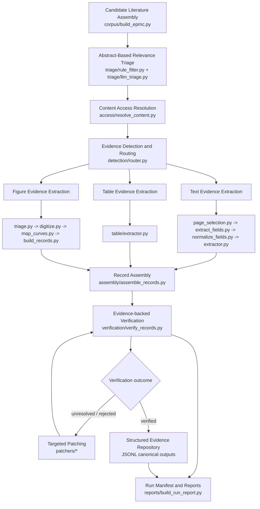

# SkinMiner

LLM 驱动的多模态科学文献挖掘框架，面向经皮 / 皮肤制剂研究场景。

[English README](./README.en.md)

本仓库的目标不是重写全部科学逻辑，而是在尽量保留已有可用流程的前提下，把原先基于 `scripts/step*.py` 的串行脚本体系，重构为一个更清晰、可复现、便于后续方法学评估和 benchmark 的模块化研究框架。

## 1. 这次重构做了什么

### 1.1 从 step 脚本迁移为 package 架构

原来的代码主要以 step 编号脚本串行组织，输入输出路径、规则判断、验证逻辑和模态提取接口分散在多个脚本中。  
现在重构为以下职责清晰的模块：

- `corpus/`
- `triage/`
- `access/`
- `detection/`
- `extractors/`
- `assembly/`
- `verification/`
- `patchers/`
- `policies/`
- `schemas/`
- `reports/`
- `utils/`

这样做的核心收益是：

- 每一层职责更单一
- 更容易单独测试和替换
- 更适合后续比较不同模型、提示词、规则配置

### 1.2 引入统一的结构化 schema

当前框架不再把最终结果只看作 CSV 行，而是统一用结构化对象表达：

- `Record`
- `EvidenceItem`
- `ContentAccess`
- `RouteDecision`
- `ExtractorRunContext`
- `PatchMetadata`
- `RecordProvenance`

对应文件：

- `schemas/models.py`

这意味着：

- JSONL 可以成为 canonical source of truth
- 每条记录都能携带证据、来源、patch 信息、confidence 和 failure reasons
- 后续做评估时更容易统计和追踪

### 1.3 把严格纳入范围集中到 policy layer

原先像 `ibuprofen 5% w/w`、`Franz diffusion cell`、`IVPT/IVRT`、`amount endpoint` 这类范围约束，容易散落在不同脚本里。  
现在统一收拢到：

- `policies/v1_strict_ibuprofen_5pct.py`
- `policies/v2_accept_wv.py`
- `policies/v3_any_ibuprofen_concentration.py`
- `policies/v4_accept_flux.py`

这样可以做到：

- scope 不再散落
- verification 可以直接复用 policy
- 后续更换 policy 不需要回头修改多个模块
- `run_pipeline.py --policy` 当前支持 `v1 / v1_strict_ibuprofen_5pct / v2 / v2_accept_wv / v3 / v3_any_ibuprofen_concentration / v4 / v4_accept_flux`

### 1.4 标准化 text / table / figure extractor 接口

Round 2 的重点之一，是把三类提取器统一成一致接口：

```python
extract(content_handle, route_decision, policy, run_context) -> list[Record]
```

统一后每个 extractor 都应：

- 产出候选 `Record`
- 附带 `EvidenceItem`
- 写入 provenance / route metadata
- 不再依赖 ad hoc CSV 作为主输出
- table extractor 当前会直接基于恢复后的 endpoint 字段做 normalization，再进入 record-level assembly

### 1.5 把 assembly 和 verification 拆开

以前“记录组装”和“最终接受 / 拒绝判断”容易混在一起。  
现在拆成两层：

- `assembly/assemble_records.py`
  负责跨模态字段整合、schema 对齐、单位归一化和 record-level consolidation
- `verification/verify_records.py`
  负责证据充分性判断、policy 检查、failure taxonomy 归类，以及 `verified / unresolved / rejected`

当前 verification 还会在最终判定前做受控的 source-backed normalization / support-evidence 补强，例如：

- 基于 route notes、source notes、evidence snippets 和 source-document fragments 补强 `device`
- `device` normalization 当前也会结合 donor / receptor / vertical diffusion / diffusion area / sampling port 等组合信号，而不只是机械地看 `Franz` 关键词
- 对 generic `diffusion cell` 的推断现在也更保守；如果缺少 permeation / barrier / donor-receptor 语境，只出现孤立的 generic 提法，不会轻易当作目标 device 证据
- 对 `PAMPA / skin PAMPA` 这类明显非目标 assay 语境，当前也会避免再被归一化成 `Franz diffusion cell`
- 在有明确证据时补强 `diffusion_area_cm2`、`api concentration` 和 `endpoint time` 的支持证据
- 在逐条 record 做 policy 判定前，先汇总同一 paper 的 `device` hints、唯一 `diffusion area` hints，以及 formulation label 级 / paper 级的 `API concentration` hints
- `study_type` 的修正现在也更克制，只优先修正原本仍然不确定的记录，而不会激进地下调已经看起来像 IVPT / IVRT 的记录
- 当前 strict verification 还会更硬地处理 `flux / Jss / percent-only / 非 5% w/w concentration` 这类不应直接进 `verified` 的记录
- verification 现在也会做 route-aware acceptance，保持 `table` 为相对更可信的主路径，而 `text / mixed / figure` 在进入 `verified` 前要求更强的交叉证据
- 每条 record 当前还会被标记 `scope_bucket`，例如 `strict_in_scope`、`recoverable_unresolved`、`useful_but_out_of_scope`
- 把这些补强限制在结构化 schema 和 evidence item 范围内，而不是把 acceptance logic 再混回 assembly
- 当前这版 verifier 还刻意偏向 `precision-first`：宁可先把高风险记录压到 `recoverable_unresolved`，也不轻易放进 `verified`
- 因此当前自动流程里的 `verified` 更接近“严格自动通过”，而不是“模拟人工终审后的最终真值”

### 1.6 把 targeted patching 升级成正式子系统

当前 patcher 不再被视为“数据清理”，而是正式的 targeted evidence recovery 能力：

- `patchers/patch_api_concentration.py`
- `patchers/patch_endpoint.py`
- `patchers/patch_endpoint_time.py`
- `patchers/patch_area.py`

设计原则是：

- 只对 unresolved 或 failed candidate records 运行
- 成功时补充新的 `EvidenceItem`
- 记录 patch metadata，支持追踪和复验
- 当前已加强 area / endpoint / endpoint time / API concentration 恢复，并允许 patcher 直接回看 source document 片段
- API concentration recovery 当前会在 table extraction / verification / patcher 三层复用同一套 context rules，减少把 excipient percentage 误识别为 ibuprofen loading 的概率
- area 和 API concentration patcher 当前也会复用同 paper / 同 formulation label 的共享 hints，减少“单条 record 片段不够，但同文献别的模态已经有答案”时的漏补
- API concentration 的 unit / basis 当前也会在 assembly 和 verification 两层做更一致的标准化，减少 `% w/w`、`% w/v`、`mg/g`、`mg/ml`、`mM` 这些表达在 schema 里留下不稳定 basis 的情况
- endpoint 和 API concentration patcher 当前也能在 strict verification 标记出“已有值但可疑”时尝试覆盖修正，而不只是字段为空时才 patch
- ablation 运行可以用 `--no-patching` 跳过所有 targeted patcher；该开关会写入 run manifest 和 resume signature

### 1.7 强化 figure 子系统的可追踪性

图像分支被整理成更明确的子管线：

- `extractors/figure/triage.py`
- `extractors/figure/digitize.py`
- `extractors/figure/map_curves.py`
- `extractors/figure/build_records.py`
- `extractors/figure/models.py`

相比旧版，当前设计更强调：

- typed intermediate artifacts
- 用 trace id 把 triage、digitization、mapping、record assembly 串起来
- digitization replay artifacts，包括 crop、mask、overlay 和 mapping zoom
- curve mapping traceability
- mapping confidence 和 provenance

### 1.8 增加可复现性输出

当前 run 过程会更系统地记录：

- run manifest
- 模型名称
- policy 名称
- prompt / config 路径
- 输入来源
- 输出统计
- failure taxonomy counts
- patch success counts

对应模块：

- `utils/manifest.py`
- `reports/build_run_report.py`
- `utils/long_run.py`
- `utils/resume.py`

当前还新增了一个更实用的工程能力：

- `--resume`
  用于阶段级断点续跑
- 已完成阶段会基于 stage marker 直接跳过
- `LLM triage / content access / routing / text / table / figure` 这些长阶段会尽量从已有 JSONL checkpoint 接着跑
- stage marker 当前还会写入 run-signature digest、input count、output count 和 output paths 等一致性信息
- `--resume` 当前会拒绝在同一个 `output-dir` 中复用不匹配的旧 stage marker
- 当旧 `.resume` marker 的 digest 因小型代码修复发生变化，但现有 `run_manifest.jsonl` 证明高层运行配置一致时，当前版本会自动走一次“软兼容”恢复并复用原有 marker
- 这比仅仅有 `long_run/*` 监控更进一步，适合真正的 overnight 或全量运行
- 最新一轮 recovery promotion 还会额外利用 `receptor_volume_ml`、双轮 endpoint shared-hint replay，以及更保守的 API concentration patching 质量比较
- 当前又进一步把 formulation concentration 和 receptor / endpoint concentration 做了上下文分离，避免 `mM / mg/mL` assay 片段轻易压过真正的 `5% w/w` formulation 证据

### 1.8.1 LLM provider 抽象层

当前 LLM 调用层已统一收口到 `utils/llm_client.py` 的轻量 provider abstraction。

- `run_pipeline.py --llm-provider` 支持 `openai` 和 `anthropic`
- 默认仍然是 `openai`，不显式切换时保持既有行为
- `--llm-provider anthropic` 会默认使用 `claude-sonnet-4-6` 作为各 stage 模型，同时仍支持 stage-level model override
- run manifest 现在会记录 `llm_provider`，并继续记录 default model 与 stage model overrides
- Anthropic SDK 采用 lazy import，OpenAI-only run 不需要加载 Anthropic SDK

### 1.9 可选 LLM triage 与当前 content strategy

当前主流程里有两个在终端状态面板中会显式显示出来的设计：

- `LLM Triage` 是可选阶段
- `Content Access + Routing` 采用 `structured-first routing + structured-first text/table extraction + auto PDF for figure and fallbacks`

对应模块：

- `run_pipeline.py`
- `triage/llm_triage.py`
- `access/content_strategy.py`
- `access/resolve_content.py`

其中：

- 如果没有传 `--with-llm-triage`，状态面板中的 `LLM Triage` 会显示 `SKIPPED / disabled`
- 这不是错误，而是表示当前 run 只使用 rule-based triage，不额外进行一次 LLM 摘要语义筛选
- 当 corpus 很宽、query 很松或 rule filter 噪声较高时，`LLM triage` 很有价值
- 当只是做小样本调试、手工整理输入或希望节约成本时，可以关闭它

当前的 content strategy 则是：

- 架构层面优先把 `PMC XML / HTML` 视为更好的文本来源
- `router` 现在会优先消费本地或远程的 `PMC XML / HTML`，只有结构化来源不可用时才回退到本地 PDF
- 当前 router 在 LLM 返回 `unresolved` 时，还会使用保守的 heuristic fallback 提升 text/table/figure/mixed recall
- `text extractor` 现在也会优先消费 `PMC XML / HTML` 的结构化证据块，只有结构化来源不可用时才回退到 PDF 页面
- `table extractor` 现在也会优先消费 `PMC XML / HTML` 的结构化表格，只有结构化来源不可用时才回退到 PDF 页面
- `figure extractor` 仍然保留最强的 legacy PDF 依赖
- 因此 pipeline 默认仍会在需要时自动补本地 PDF，而不再要求必须显式加 `--download-content`
- 如果要关闭自动补 PDF，可以显式传 `--no-auto-pdf-download`

### 1.10 Figure 前处理、bbox 回放与 blockage summary

这一轮又补了几项更偏工程稳定性的增强：

- `extractors/figure/digitize.py` 现在不再只被动依赖 triage 给出的 `plot_bbox`
- 当 triage bbox 不可用时，会尝试自动检测 plot 区域；当 bbox 粗糙时，会基于前景再做一次收紧
- digitization 现在会额外落地：
  - `bbox overlay`
  - `preprocessed image`
  - 更细的 edge / bbox diagnostics
- 这使 figure failure 不再只有结果计数，还能更直观看到到底是 plot context 缺失、bbox 偏移，还是 edge 不足

同时，`reports/build_run_report.py` 现在还会生成更明确的 blockage summary：

- access 为什么 unresolved / error
- routing 为什么 unresolved
- text/table extractor 为什么 source error
- patcher 为什么 skipped / failed

另外，figure failure 的传播现在也更克制了：

- assembly 只会把 paper-level 的 figure failure notes 附加到 `figure` / `mixed` 记录，而不会无差别污染同 paper 的全部 text/table 记录
- verification 也不会因为同 paper 的某条 curve 失败，就把已经有成功 figure endpoint evidence 的 record 再标成 `figure_digitization_failed`

除原有 `run_report.json` / `run_report.md` 外，还会新增：

- `report/blockage_summary.csv`

### 1.11 Query / Prompt 版本化与 evaluation 模板

为了让后续实验真正可比，当前框架已经把 query 和 prompt 做成了可记录的版本化资产：

- `corpus/query_profiles.py`
  - 提供命名 query profile
  - 当前至少包含 baseline OA query 和更收紧的 Franz-focus query
- `run_pipeline.py`
  - 新增 `--query-profile`
  - 新增 `--list-query-profiles`
  - 仍然允许用 `--query` 做临时 override
- run manifest 和 run report 现在都会记录：
  - `query_profile`
  - `query_profile_version`
  - `query_source`
  - `prompt_assets`

另外，evaluation 准备工作也已经从 TODO 变成了正式目录骨架：

- `evaluation/README.md`
- `evaluation/fixtures/README.md`
- `evaluation/gold_labels.schema.json`
- `evaluation/templates/fixture_manifest_template.json`
- `evaluation/templates/gold_labels_template.jsonl`

这部分目前还不是完整评测系统，但已经足够支撑后续建立：

- text-only fixtures
- table-only fixtures
- figure-only fixtures
- mixed-route fixtures
- record-level gold labels

### 1.12 本轮进一步增强：device / API、figure failure feedback、run profile、remote cache、evaluation CLI

这一轮又补了 6 类更偏“全量实验可用性”的增强：

- `device normalization` 继续加强
  - `extractors/common.py`
  - `verification/verify_records.py`
  - 现在不仅更容易把 `Franz diffusion cell` 和 generic `diffusion cell` 区分开，也会主动挑选更像样的 support fragment
- `API concentration recovery` 继续加强
  - `utils/units.py`
  - `patchers/patch_api_concentration.py`
  - `verification/verify_records.py`
  - 现在会更多复用 component-level 线索，并补了更丰富的 `% w/w` / `mg/g` / `mg per g` / `drug loading` 表达解析
- figure failures 现在不再只停留在 report 统计层
  - `extractors/figure/build_records.py`
  - `assembly/assemble_records.py`
  - `verification/failure_taxonomy.py`
  - `verification/verify_records.py`
  - digitization / plot-context / mapping unresolved 现在会以 paper-level source notes 形式进入 assembly 和 verification
- 新增命名 `run profile`
  - `configs/run_profiles.py`
  - `run_pipeline.py`
  - 现在可以用 `--run-profile` 固定常见运行模式，例如：
    - `balanced_full`
    - `text_table_baseline`
    - `budget_lean`
    - `figure_deep`
- 新增 remote structured source cache
  - `utils/source_cache.py`
  - `detection/router.py`
  - `extractors/text/page_selection.py`
  - `extractors/table/extractor.py`
  - `patchers/common.py`
  - 远程 HTML / XML 读取现在会稳定缓存到本地，减少重复请求和站点波动
- evaluation 不再只有模板目录
  - `evaluation/models.py`
  - `evaluation/validate_gold_labels.py`
  - `evaluation/score_run.py`
  - 现在已经可以做 gold labels 校验和轻量 run-vs-gold 对比

这也意味着你现在除了常规运行，还可以直接查看：

- `python run_pipeline.py --list-run-profiles`
- `python -m evaluation.validate_gold_labels --gold-jsonl evaluation/templates/gold_labels_template.jsonl`
- `python -m evaluation.score_run --gold-jsonl <gold.jsonl> --predicted-jsonl <records.jsonl> --output-json <summary.json>`
- `python -m evaluation.validate_gold_labels --gold-csv outputs/gold_audit_set/gold_set_seed_round1.csv`
- `python -m evaluation.score_run --gold-csv outputs/gold_audit_set/gold_set_seed_round1.csv --output-json outputs/gold_audit_set/score_round1.json --output-md outputs/gold_audit_set/score_round1_summary.md`
- 这一路径当前也支持基于 `gold_scope_correct / gold_value_correct` 的 scope precision 与 end-to-end precision 拆分统计

## 2. 新架构总览

下面这张图是当前框架的主流程：



如果用更接近方法学论文的语言来描述，当前框架对应以下 7 个主阶段：

1. Candidate Literature Assembly
2. Abstract-Based Relevance Triage
3. Content Access Resolution
4. Evidence Detection and Routing
5. Modality-Specific Extraction
6. Record Assembly and Evidence-Backed Verification
7. Structured Evidence Repository / Dataset View

## 3. 模块与职责对应表

### 3.1 `corpus/`

核心文件：

- `corpus/build_epmc.py`

职责：

- Europe PMC 检索
- query / max results / output 路径可配置
- 去重并输出候选 corpus

### 3.2 `triage/`

核心文件：

- `triage/rule_filter.py`
- `triage/llm_triage.py`
- `triage/prompts.py`

职责：

- 规则级摘要筛选
- LLM 级摘要 triage
- 输出 relevance label、confidence 和 hints
- `LLM triage` 在主流程中是可选阶段，不开启时状态面板会显示 `SKIPPED / disabled`

### 3.3 `access/`

核心文件：

- `access/resolve_content.py`

职责：

- OA-only content resolution
- PMC XML 优先
- HTML 次选
- 必要时 PDF fallback
- 当前默认 content strategy 是 `structured-first routing + structured-first text/table extraction + auto PDF for figure and fallbacks`
- 终端状态面板中的 `Content Strategy` 现在会直接显示 `routing / text / table / figure` 各自的 backend
- `--download-content` 表示主动下载 primary OA content
- 即使不显式传 `--download-content`，如果 figure 分支或 PDF fallback 仍需要本地 PDF，系统也会按需自动补齐
- 输出统一 `ContentAccess`

### 3.4 `detection/`

核心文件：

- `detection/router.py`

职责：

- 基于全文锚点证据做 route 决策
- 当前 `router` 优先消费 `PMC XML / HTML`，只有结构化来源不可用时才回退到本地 PDF
- route 类型包括：
  - `text`
  - `table`
  - `figure`
  - `mixed`
  - `unresolved`
- 保留 anchor evidence 和 route rationale

### 3.5 `extractors/text/`

核心文件：

- `extractors/text/page_selection.py`
- `extractors/text/extract_fields.py`
- `extractors/text/normalize_fields.py`
- `extractors/text/extractor.py`

职责：

- 先做结构化证据块或 PDF 页面窗口选择
- 再做字段提取
- 最后做字段标准化
- 强化对 endpoint、endpoint time、device、barrier、conditions 的支持
- 输出 evidence-backed `Record`

### 3.6 `extractors/table/`

核心文件：

- `extractors/table/extractor.py`

职责：

- 把 table 作为独立模态处理，而不是 text extraction 的副作用
- 优先消费 `PMC XML / HTML` 的结构化表格，再在必要时回退到 PDF 页面
- 提取 formulation composition
- 提取 ingredient concentration
- 提取 endpoint summary values
- 保留单位和 basis 信息
- 输出标准化 `Record`

### 3.7 `extractors/figure/`

核心文件：

- `extractors/figure/models.py`
- `extractors/figure/triage.py`
- `extractors/figure/digitize.py`
- `extractors/figure/map_curves.py`
- `extractors/figure/build_records.py`

职责：

- figure triage
- CV-based digitization
- curve-to-formulation mapping
- 生成 replay artifacts，包括 triage page images、digitization crops、masks、overlays 以及 mapping zooms
- 构建 figure-backed records
- 保留 mapping confidence、typed endpoint artifacts、diagnostic metadata 和可回溯 provenance chain

### 3.8 `assembly/`

核心文件：

- `assembly/assemble_records.py`

职责：

- 跨模态整合 candidate records
- 合并字段并做 schema 标准化
- 做单位归一化和 record-level consolidation
- 不负责最终 acceptance decision

### 3.9 `verification/`

核心文件：

- `verification/verify_records.py`
- `verification/failure_taxonomy.py`

职责：

- 检查证据是否充分
- 应用 policy 检查
- 输出：
  - `verified`
  - `unresolved`
  - `rejected`
- 为失败样本赋予结构化 failure reasons

### 3.10 `patchers/`

核心文件：

- `patchers/patch_api_concentration.py`
- `patchers/patch_endpoint.py`
- `patchers/patch_endpoint_time.py`
- `patchers/patch_area.py`
- `patchers/common.py`

职责：

- 面向 unresolved / failed records 做 targeted evidence recovery
- 回补 API concentration / endpoint time / area 等关键字段
- 成功时写入新的 `EvidenceItem`
- 保留 patch metadata 供再验证和报告使用

### 3.11 `reports/`

核心文件：

- `reports/build_run_report.py`
- `reports/migration_notes_round1.md`
- `reports/evaluation_round_todos.md`
- `reports/next_step_optimization_tasks.md`

职责：

- 生成 run-level report
- 统计 route distribution
- 统计 extractor outputs
- 统计 verification outcomes
- 统计 `scope_bucket`，区分 `strict_in_scope`、`recoverable_unresolved` 和 `useful_but_out_of_scope`
- 统计 failure taxonomy buckets
- 统计按 route 拆分的 failure taxonomy
- 单独统计 figure triage / digitization / mapping 的失败原因
- 在 long-run mode 开启时额外汇总 LLM retry / malformed-output 等 reliability 指标
- 统计 patch success
- 导出 CSV 视图
- 为未来 evaluation round 预留 TODO hooks

### 3.12 `schemas/`、`utils/` 与共享层

核心文件：

- `schemas/models.py`
- `utils/io.py`
- `utils/manifest.py`
- `utils/units.py`
- `extractors/common.py`

职责：

- 共享 schema 定义
- JSONL / CSV 导出
- run manifest 记录
- 单位标准化
- 共享 API concentration parsing 与 context rules
- 更强的 device label normalization helper
- extractor 通用 provenance / artifact helpers

## 4. 当前目录结构

```text
project_root/
  corpus/
  triage/
  access/
  detection/
  extractors/
    text/
    table/
    figure/
  assembly/
  verification/
  patchers/
  policies/
  schemas/
  reports/
  utils/
  scripts/           # 保留旧 step 脚本作参考
  run_pipeline.py
```

## 5. 旧脚本与新模块映射

| 旧脚本 | 新模块 |
| --- | --- |
| `step1_build_corpus_epmc.py` | `corpus/build_epmc.py` |
| `step2_rule_screen.py` | `triage/rule_filter.py` |
| `step3_stage2_openai.py` | `triage/llm_triage.py` |
| `step4_2_make_fulltext_inventory.py` + `step4_3_download_fulltext_oa.py` | `access/resolve_content.py` |
| `step5_evidence_index_openai_v1_3.py` | `detection/router.py` |
| `step6_extract_records_openai_v1_2.py` | `extractors/text/*` |
| `step7_formulation_table_extract_openai.py` | `extractors/table/extractor.py` |
| `step7_figure_triage_openai.py` | `extractors/figure/triage.py` |
| `step7_figure_digitize_cv.py` | `extractors/figure/digitize.py` |
| `step7_map_curves_to_formulations_openai_vision.py` | `extractors/figure/map_curves.py` |
| `step7_build_figure_records.py` | `extractors/figure/build_records.py` |
| `step7_merge_text_figure_v1.py` | `assembly/assemble_records.py` |
| `step6_5_verify_openai.py` + scope logic | `verification/*` + `policies/*` |

## 6. 主流程入口

主入口：

- `run_pipeline.py`

当前最小主流程为：

1. 构建或读取 corpus
2. rule triage
3. optional LLM triage
4. OA access resolution
5. structured-first routing context preparation + automatic PDF materialization when needed by the figure branch or PDF fallbacks
6. routing
7. table extraction
8. structured-first text extraction with PDF fallback
9. optional figure extraction
10. assembly
11. initial verification
12. targeted patching
13. re-verification
14. report / manifest / export

示意命令：

```bash
python run_pipeline.py --input-csv data/corpus_ibuprofen.csv --with-llm-triage --enable-figure --export-csv
```

轻量运行示意：

```bash
python run_pipeline.py --input-csv data/corpus_ibuprofen.csv
```

如果想关闭默认的自动 PDF 补齐：

```bash
python run_pipeline.py --input-csv data/corpus_ibuprofen.csv --no-auto-pdf-download
```

长任务运行模式：

```bash
python run_pipeline.py --build-corpus --max-results 50000 --with-llm-triage --enable-figure --export-csv --long-run-mode --progress-every 10 --access-checkpoint-every 10 --long-run-log-every 10 --output-dir outputs/full_run_01
```

这个模式会额外持续写出：

- `long_run/events.jsonl`
  阶段开始、进度、完成、失败、LLM usage 事件流
- `long_run/state.json`
  当前运行快照，适合在长跑过程中查看“现在卡在哪”
- `long_run/summary.json`
  运行结束后的汇总，包括最后异常位置、按模块累计的 LLM usage，以及每个 LLM 模块的 retry / malformed-output 统计

适合 overnight 或全量运行。它不会替代 `run_manifest.jsonl` 和 `report/run_report.*`，而是补一层更细粒度的运行轨迹。
当前 text/table 批处理还会把单篇文章的 source failure 记入 raw JSONL 并跳过，而不是让整批任务直接中断。

断点续跑模式：

```bash
python run_pipeline.py --build-corpus --max-results 50000 --with-llm-triage --enable-figure --export-csv --long-run-mode --resume --progress-every 10 --access-checkpoint-every 10 --long-run-log-every 10 --output-dir outputs/full_run_03
```

说明：

- `--resume` 应该和同一个 `--output-dir` 配合使用
- 已完成阶段会写入 `.resume/<stage>.done.json`
- 已完成阶段的 marker 现在还会记录 run-signature digest 和基础 input/output 一致性信息
- 如果上一次运行中断，下一次会优先跳过已完成阶段
- 对 `LLM triage / content access / routing / text / table / figure`，如果只有部分 JSONL 已写出但阶段还没完成，会优先基于这些 checkpoint 继续
- 如果当前运行配置与已有 run signature 不匹配，`--resume` 会直接报错，而不是静默复用旧输出
- 如果只是代码修复导致 digest 变化，但 manifest 显示 `model / policy / run profile / query profile / adjudication` 等高层配置未变，`--resume` 现在会自动沿用旧 digest 继续同一批 run
- `long_run/*` 仍然负责监控和审计；`--resume` 负责恢复执行

## 7. 输出原则

### 7.1 Canonical output

- JSONL 是唯一 canonical record format
- CSV 只作为 export / view
- 任一模块都不应依赖 CSV 作为唯一真实来源

### 7.2 常见输出

- `corpus.jsonl`
- `rule_pass.jsonl`
- `llm_triage.jsonl`
- `content_access.jsonl`
- `route_decisions.jsonl`
- `table_records.jsonl`
- `text_records.jsonl`
- `figure_records.jsonl`
- `assembled_records.jsonl`
- `verified_records.jsonl`
- patcher 中间 JSONL
- `run_manifest.jsonl`
- `report/run_report.json`
- `report/run_report.md`
- `report/figure_failure_summary.csv`
- `report/llm_reliability_summary.csv`

说明：

- `verified_records.jsonl` 这个名字保留了历史兼容性，但它表示“完成最终 verification 的 records”
- 它里面可能同时包含 `verified`、`unresolved`、`rejected`
- 真正通过严格 policy 的数量，应看 `verification_status == verified`，或直接看终端末尾的 `Actually verified`

## 8. 核心数据对象

### 8.1 `Record`

`Record` 是全流程统一的结构化对象，通常包括：

- 基本标识：`record_id`, `paper_id`, `doi`
- 路由信息：`route`, `route_confidence`
- 提取结果：`formulation`, `endpoint`, `conditions`
- 证据：`evidence_items`
- provenance：`provenance`
- patch metadata：`patches`
- confidence hooks：
  - `extractor_confidence`
  - `mapping_confidence`
  - `verification_support_rate`
- verification：
  - `verification_status`
  - `failure_reason`
  - `failure_reasons`

### 8.1.1 Formulation 与条件字段

`Record.formulation` 当前保留 API、浓度、剂型、制剂标签，以及 `components` 成分列表。`components` 用于记录 API 以外的 vehicle / excipient composition，例如辅料名称、浓度、basis、原始文本和备注。

`Record.conditions` 除 diffusion area、receptor volume、duration 和 replicate count 外，还包含药剂学解释所需的实验上下文字段：

- `membrane_type`：膜或皮肤类型，例如 human cadaver skin、porcine ear skin、Strat-M。
- `membrane_source`：来源类别，例如 human、porcine、rat、synthetic。
- `membrane_thickness_um`：膜厚度，单位为 µm。
- `receptor_medium`：受体介质，例如 PBS pH 7.4 或 PBS + surfactant。
- `dose_type`：finite / infinite dose。
- `dose_amount`：给药量或原文剂量描述，例如 `5 mg/cm²`、`200 µL`、`infinite dose`。

这些字段目前是结构化记录字段，不参与 verification scope gate、policy 判定或 failure taxonomy；缺失不会导致 record 被 reject。

### 8.2 `EvidenceItem`

每个 `EvidenceItem` 通常包括：

- `field_name`
- `modality`
- `locator`
- `page`
- `bbox`
- `snippet`
- `source_ref`
- `confidence`

## 9. Failure Taxonomy

当前 verification 复用的 failure taxonomy 包括：

- `missing_endpoint`
- `missing_endpoint_time`
- `missing_area`
- `missing_api_concentration`
- `not_target_api`
- `not_target_device`
- `not_target_study_type`
- `percent_only`
- `unresolved_route`
- `ambiguous_mapping`
- `insufficient_evidence`
- `unit_normalization_failed`

这套 taxonomy 会被以下模块共享：

- verification
- reports
- patchers

## 10. 当前架构适合做什么

当前版本已经适合用于：

- 方法学开发
- 比较不同 LLM / prompt / 配置的抽取表现
- 比较不同 route 的成功率
- 分析 verification failure buckets
- 评估 targeted patching 的收益
- 为后续 benchmark / ablation 做准备

## 11. 当前刻意不做的事情

当前版本刻意不引入以下复杂度：

- 非 OA acquisition
- supplementary 作为主处理分支
- 数据库 / web UI / task queue / cloud orchestration
- 完整 benchmark / gold evaluation suite

未来 evaluation 相关规划可见：

- `reports/evaluation_round_todos.md`
- `reports/experiment_design_checklist.md`
- `reports/architecture_engineering_backlog.md`
- `reports/next_step_optimization_tasks.md`

针对 `full_run_07_full` 的人工复核误差分析可见：

- `outputs/full_run_07_full/report/manual_review_error_analysis.md`

## 12. 推荐阅读顺序

如果想快速理解当前代码结构，建议按下面顺序阅读：

1. `run_pipeline.py`
2. `schemas/models.py`
3. `policies/v1_strict_ibuprofen_5pct.py`
4. `detection/router.py`
5. `extractors/text/`
6. `extractors/table/extractor.py`
7. `extractors/figure/`
8. `assembly/assemble_records.py`
9. `verification/verify_records.py`
10. `patchers/`
11. `reports/build_run_report.py`

## 13. 最新稳定性更新

最近这一轮工程增强主要针对三类会直接影响全量运行结果的问题：

- `extractors/figure/digitize.py`
  - figure digitization 现在会尝试多个候选 page image，而不是只依赖单个 `selected_image_path`
  - 同一张图现在会评估多种 bbox 方案，包括 refined triage bbox、expanded bbox、auto-detected bbox，以及最后的默认 plot 区域回退
  - 目标是压低 `fail_missing_plot_context`，并改善一部分 `fail_few_edges`
  - figure mapping 现在也会优先消费 digitizer 已经选好的 crop / bbox，不再假设最初 triage 的 image 和 bbox 一定可直接复用

- `access/resolve_content.py`、`utils/source_cache.py`、`detection/router.py`
  - OA access 的 HTTP 请求现在带轻量重试和退避
  - 当远程结构化来源暂时不可用时，source cache 现在允许复用旧的 cached structured text 作为 stale fallback
  - router 现在会主动识别并跳过 JavaScript wall、access denied、purchase page 这类 blocked / low-signal HTML/XML，而不是把它们误当作正常 structured source

- `configs/run_profiles.py`、`run_pipeline.py`、`reports/build_run_report.py`
  - run profile 现在包含显式的 figure gating 配置
  - `balanced_full` 默认采用更保守的 figure gating，会结合 route confidence 和显式 figure evidence 决定是否真的进入 figure branch
  - `figure_deep` 则保留更激进的 figure 路径
  - run report 现在会输出 `figure_gate_counts`，方便判断 full profile 是被 gate 掉了，还是进了 digitization 但失败了
- 当 `--resume` 检测到旧 stage marker 与当前运行配置不兼容时，CLI 报错现在会直接附带一个建议的新 `--output-dir`，而不只是提示删除 `.resume`

- `verification/verify_records.py`、`patchers/patch_endpoint.py`、`patchers/patch_api_concentration.py`、`utils/units.py`
  - area 解析现在支持 `cm 2 / mm 2` 这类带空格的单位写法，能更稳定地从 source fragments 中恢复 donor / diffusion area
  - verification 当前会额外解析 `receptor / receiver volume`，并允许把 `µg/mL` 这类 receptor-concentration endpoint 结合 volume 和 area 换算回 `ug/cm^2`
  - endpoint patcher 当前会做两轮 shared-hint replay，因此同一篇 paper 内先被修正的 endpoint 可以在第二轮带起同 label 的兄弟记录
  - API concentration patcher 当前会比较“新旧候选质量”，避免把已有的 `5%` 线索错误覆盖成更弱的 `mg/mL / mM` 线索

### 1.11 可选 LLM Adjudication 原型

为了后续实验保留“第二意见层”的空间，当前仓库新增了一个**可选**原型：

- `verification/llm_adjudicate.py`

当前状态：

- `LLM adjudication` 现在可以通过 `--with-llm-adjudication` 接入 `run_pipeline.py`，但仍然是 **audit-only**
- audit-only 模式现在更聚焦于 `recoverable_unresolved` 记录的 rescue ranking，而不是把大量已决记录重新当成第二个 verifier 来审
- 它会输出第二意见 JSONL/CSV 和 `report/llm_adjudication_summary.csv`，但不会覆盖 `verified_records`
- 最近一轮 formulation recovery 更新还会显式区分 `% (w/w)` / `% (w/v)`，避免把 `4.6 mm` 误当成 `4.6 mM`，并在 strict scope 下优先采用更强的 `5% w/w` hint

它的定位不是替代主 `verification`，而是：

- 重点对高价值 `recoverable_unresolved`
- 尤其是 `ambiguous_api_concentration / missing_area / missing_endpoint / unit_normalization_failed`
- 用作“哪些 unresolved 最值得救回”的排序辅助

做一次更接近人工复核风格的 LLM 二次判读。

当前设计原则是：

- `rule-based verification` 仍然是生产 pipeline 的主 verifier
- `LLM adjudication` 只是可选的 second opinion layer
- 默认不接入主流程，不改变当前 `run_pipeline.py` 的自动输出
- 更适合作为离线诊断、误差分析、后续 benchmark 或 selective override 实验模块

这样做的原因是：

- strict scope 需要稳定、可重复、可审计的硬边界
- 如果 extraction 和 verification 都完全交给 LLM，更容易出现 correlated error / self-confirmation

## 14. 最新补充：support promotion 与阶段级模型

- `assembly/assemble_records.py` 现在会更主动地把高质量 `table` 支撑记录 merge 到相关 `text / mixed / figure` records 里，尤其是 formulation label、API concentration、diffusion area 和对应 support evidence。
- `verification/verify_records.py` 现在会给 `recoverable_unresolved` 增加更细的 `scope_tags`，例如 `recoverable_api_basis`、`recoverable_area`、`recoverable_endpoint`、`recoverable_endpoint_time`、`recoverable_support_gap`，便于后续 recovery 和报告分析。
- `reports/build_run_report.py` 现在会统计 `scope_tag_counts`，所以 run report 不再只看粗粒度 `scope_bucket`。
- `run_pipeline.py` 现在支持阶段级模型覆盖。除全局 `--model` 外，还可以单独设置：
  - `--llm-triage-model`
  - `--routing-model`
  - `--text-model`
  - `--table-model`
  - `--figure-triage-model`
  - `--figure-vlm-model`
  - `--figure-map-model`
  - `--llm-adjudication-model`
- 这些阶段级模型配置会写入 run manifest 和 run report，也会参与 resume signature 校验。
- 当前 manual review 的定位是离线校准，不是生产 pipeline 的必需环节

## 15. Latest support-gap fixes

- `extractors/common.py` now keeps strong `Franz diffusion cell` evidence in comparative papers that also mention `PAMPA`, instead of dropping the device label too early.
- `extractors/common.py` now stores `route_anchor_evidence` in record provenance metadata so later verification can reuse router-level evidence.
- `verification/verify_records.py` now consumes router anchor evidence as real support for `device`, `endpoint`, and `formulation`, which reduces false `recoverable_support_gap` cases.
- `utils/units.py`, `assembly/assemble_records.py`, and `verification/verify_records.py` now coerce endpoints with explicit per-area units such as `ug/cm^2` from `amount_total` to `amount_per_area`, so these records are no longer blocked by unnecessary `missing_area` failures.

## 16. Latest router-to-verifier signal propagation

- `extractors/common.py` now also stores `route_raw_labels` in provenance metadata, not only `route_anchor_evidence`.
- `extractors/table/extractor.py` and `extractors/text/normalize_fields.py` no longer fall back to a generic `diffusion cell` label unless routing metadata explicitly supports it.
- `verification/verify_records.py` now consumes `route_raw_labels` such as `franz_confirmed`, `where_franz`, `where_diffusion_cell`, and `endpoint_carrier_snippet` when normalizing `device`, `study_type`, `endpoint_time`, and support evidence.
- `extractors/figure/build_records.py` now preserves upstream routing metadata when figure-derived records are built from table-backed source records, so figure verification can see the same routing context as the earlier modalities.

## 17. Latest observability additions

- `run_pipeline.py` now includes `verification.llm_adjudication` in `prompt_assets` and `prompt_paths`, so the adjudication prompt version is tracked in the manifest and run report alongside the other LLM stages.
- `extractors/figure/triage.py` now writes an explicit `has_permeation_plot` boolean to every triage artifact. This is derived from existing triage outputs and is intended for aggregation only; it does not change triage behavior.
- `extractors/figure/digitize.py` now emits an explicit endpoint-style failure row with `status=digitization_no_output` when a figure is triaged as digitizable but produces no downstream digitization output. This closes the previous silent-loss gap in the figure funnel without changing digitization logic.
- `extractors/figure/digitize.py` now also writes a `candidate_tier` field to digitized curve/endpoint artifacts, with values `triage_primary`, `same_page_alt`, or `cross_page_fallback`, so source-binding audits can see which image tier actually won.
- `reports/build_run_report.py` now reports both `triage_has_permeation_plot_true` and `digitization_no_output` counts in the figure section, making the figure funnel more auditable end to end.

## 18. Latest direct-figure VLM path

- `run_pipeline.py` now supports a dedicated `--figure-vlm-model` override for the locked-subplot VLM value-reading stage.
- `extractors/figure/vlm_digitize.py` adds a conservative parallel VLM path for direct figure rows only, using the locked subplot crop plus structured context such as axis ranges, known formulation labels, crop resolution, and source render DPI.
- `run_pipeline.py` now tracks `extractors.figure.vlm_digitize` in prompt assets, and `reports/build_run_report.py` reports `vlm_readings_total`, `vlm_readings_readable`, `vlm_used_as_final`, and VLM reconciliation-status counts.
- The first implementation is precision-first: CV/VLM disagreement does not auto-promote a figure row to `verified`; instead the row remains unresolved unless a safer path exists.

## 19. Latest policy and ablation controls

- `policies/v2_accept_wv.py` adds a V2 policy that keeps the V1 strict ibuprofen/Franz/amount/time gates but also accepts `5% w/v` and `50 mg/mL` as valid concentration bases.
- `policies/v3_any_ibuprofen_concentration.py` adds an E8 relaxed-scope policy that keeps the non-concentration V1 gates but accepts any explicitly ibuprofen concentration.
- `policies/v4_accept_flux.py` adds a policy-sensitivity scope that inherits V3 concentration behavior and also accepts flux/Jss plus explicitly grounded Kp/Papp/permeability coefficient endpoints.
- `run_pipeline.py --policy` can select `v1`, `v1_strict_ibuprofen_5pct`, `v2`, `v2_accept_wv`, `v3`, `v3_any_ibuprofen_concentration`, `v4`, or `v4_accept_flux`; the selected policy is stored in the run manifest and resume signature.
- `assembly/assemble_records.py` can propagate unique same-paper table API-concentration support into table endpoint rows without implicitly converting `w/v` to `w/w`.
- `utils/units.py` parses spaced slash forms such as `% w / v`, so unit normalization is no longer sensitive to slash spacing.
- `run_pipeline.py --no-patching` disables `patch_api_concentration`, `patch_endpoint_value`, `patch_endpoint_time`, and `patch_area` for E6-style ablation runs.
- `run_pipeline.py --no-table-promotion` disables assembly-time table-support promotion into non-table records for E7-style ablation runs; same-paper table concentration propagation remains enabled.
- Both ablation switches are recorded as `patching_enabled` and `table_promotion_enabled` in the manifest and resume signature.

## 20. 最新 schema 与 table extraction 控制

- `ConditionSpec` 现在包含 `membrane_type`、`membrane_source`、`membrane_thickness_um`、`receptor_medium`、`dose_type`、`dose_amount`；字段缺失本身不参与 policy gate，但 figure-route 中与 endpoint source context 明显冲突的 condition 会被 source-binding guard 标为 unresolved。
- text 和 table extraction prompt 现在会显式要求提取 membrane、receptor medium、dose、vehicle/excipient composition。
- table extraction prompt asset `extractors.table.structured_tables` 现在是 `2026-04-11.v1`；它显式要求返回每个相关 table row 和每个 formulation × timepoint endpoint cell，而不是代表性行。
- text extraction prompt asset `extractors.text.structured_fields` 现在是 `2026-04-11.v1`；它要求输出条件上下文和 excipient evidence。
- figure VLM prompt asset `extractors.figure.vlm_digitize` 现在是 `2026-04-11.v1`；它会接收来自 source table/text records 的已知 membrane/receptor/dose context，但不会从 figure crop 自行推断这些字段。
- HTML table extraction 现在每张表最多读取 60 行。如果 table 或 window 被截断，`table_truncated` 和 `truncation_notes` 会写入 `table_raw.jsonl` 和 record provenance metadata。
- 对明确包含 cumulative amount 多时间点列的 structured wide endpoint table，table extractor 会保守展开为每个 formulation × timepoint 一条 record。

## 21. 最新 figure source-binding guard

- `verification/source_binding_guard.py` 新增 record-level source-context 一致性检查，并通过 `verification/verify_records.py` 接入最终 policy 判定。
- 新 failure taxonomy code：`source_context_inconsistent`。它属于 recoverable unresolved，不会把记录判为 rejected，但会阻止 source context 不一致的记录进入 `verified`。
- figure-route records 现在会检查 endpoint value、endpoint time、formulation label、figure mapping、membrane/dose condition 是否来自同一 figure/subplot 或明确兼容的 source context。
- `extractors/figure/build_records.py` 不再无条件复制 table source record 的 membrane/receptor/dose condition 到 figure records；figure records 只保留 figure-context-grounded condition，无法从 figure/subplot context 确认的 condition 字段留空。
- CV-only figure mapping 在没有 VLM agreement、legend/marker/source-label 强 grounding 时，会被视为 weak figure mapping，避免仅凭 endpoint magnitude 或语义猜测进入 `verified`。
- 这是一项 precision-first guard：预期会减少 contaminated figure-route verified 记录，并把需要人工或后续修复的记录降级为 unresolved。

## 22. 最新 calibration-gate retry

- `extractors/figure/triage.py` 现在只在 `calibration_curve_not_target` gate 触发时启用 second-pass retry；它会排除 primary calibration figure，并在同一 paper 中最多重试 3 个候选 page。
- retry candidate pages 优先来自 router endpoint hint 中的 figure mention，例如 `Figure 11 shows ... permeated vs time`；如果没有明确 figure number，才回退到原始 `page_scores`。
- `FigureTriageArtifact` 新增 `triage_retry_triggered`、`triage_retry_reason`、`triage_retry_candidate_pages`、`triage_retry_candidate_page`、`triage_retry_result` 等观测字段，这些字段会传递到 figure record provenance metadata。
- `extractors/figure/digitize.py` 对 retry/permeation triage 提供的显式 `plot_bbox` 给予优先级，避免 subplot 固定网格或整页 fallback 覆盖目标 plot crop。
- `extractors/figure/map_curves.py` 对 single-curve/single-source-label 场景使用 deterministic `single_source_label_exact_match` grounding，使 Fix 6 source-binding guard 能识别这是强 source-label binding。
- 对 calibration-retry 恢复的 single-source-label record，如果 VLM 高置信、source-label grounded，且与 CV 明显分歧，`extractors/figure/build_records.py` 会保守采用 VLM final，并记录 `figure_extraction_method=vlm_retry_cv_disagreement`。
- figure records 现在同时保留 retry figure pages 和 source table/method pages，便于 verification 正确恢复 diffusion area、receptor volume 等 support context。
- `utils/units.py` 对 receptor volume 和 receptor-concentration normalization 做了上下文收紧：避免把 donor gel volume 或 membrane-prep buffer volume 当作 receptor volume，并优先把 `ug/mL` 类 endpoint 乘以 receptor volume 后再按 area 归一化。
